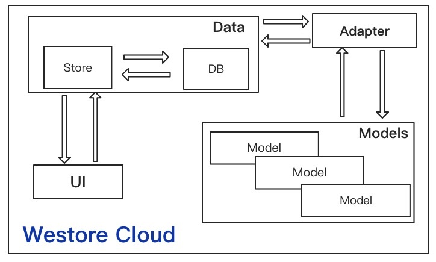
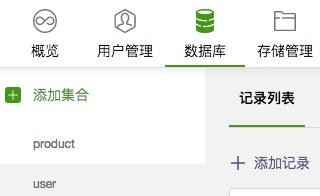
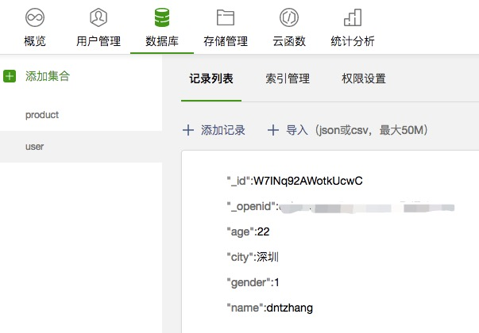

# Westore Cloud - 隐形云，好的设计便是感觉不到设计的存在

## 小程序云开发简介

开发者可以使用云开发开发微信小程序、小游戏，无需搭建服务器，即可使用云端能力。

云开发为开发者提供完整的云端支持，弱化后端和运维概念，无需搭建服务器，使用平台提供的 API 进行核心业务开发，即可实现快速上线和迭代，同时这一能力，同开发者已经使用的云服务相互兼容，并不互斥。

目前提供三大基础能力支持：

* 云函数：在云端运行的代码，微信私有协议天然鉴权，开发者只需编写自身业务逻辑代码
* 数据库：一个既可在小程序前端操作，也能在云函数中读写的 JSON 数据库
* 存储：在小程序前端直接上传/下载云端文件，在云开发控制台可视化管理

关于小程序云更多信息的官方文档可以[点击这里](https://developers.weixin.qq.com/miniprogram/dev/wxcloud/basis/getting-started.html)

## Westore Cloud 简介

Westore Cloud 在基于小程序云的数据库能力，让开发者感知不到数据库的存在(隐形云)，只需要专注于本地数据、本地数据逻辑和本地数据的流动，通过简单的 pull、push、add 和 remove 同步本地数据库和云数据库。数据库相关的官方文档可以[点这里](https://developers.weixin.qq.com/miniprogram/dev/wxcloud/guide/database.html)。架构图如下所示:



典型的 Data First 架构设计，小型项目可以去掉 Models 和 Adapter 两大模块。

## Westore Cloud 特性

* 小程序直连数据库
* 数据库数据项函数扩展
* 极简的 API(pull push add remove)
* 只需要一种编程语言(javascript)编写前端、后端、mongodb 
* 开发者只需专注数据和数据的逻辑(即store)，隐形的数据库同步功能
* 无延迟的设计(先更新本地刷新视图、再sync db、最后 diff 本地更新视图)

## 快速入门

### 新建集合



### 定义映射 Store

安装上面建立的集合名称一一对应建立好 store 的 data:

```js
export default {
  data: {
    //user 对应 db 的 collectionName
    'user':[],
    //其他 collection 可以继续添加
    'product': []
  },
  env:'test-06eb2e'
}
```

上面的 env 对应云控制台的环境 ID:


### 新增测试数据

通过 add 方法往集合 user 添加数据:

```js
this.store.add('user', {
  name: 'dntzhang',
  city: '深圳',
  age: 22,
  gender: 1
}).then((res) => { })
```

通过 add 方法往集合 product 添加数据:

```js
this.store.add('product', {
  address:{
    province:'广东省',
    city:'深圳市',
  }
})
```



### 扩展数据库每项方法

```js
export default {
  data: {
    'user':[],
    'product': []
  },
  methods:{
    //这里可以扩展 collection 每一项的方法
    'product':{
      'agentString':function(){
        return this.agent.join('-')
      }
    }
  },
  env:'test-06eb2e'
}
```

通过上面的扩展方法，在遍历 product 表的每一项时，可以直接使用 agentString 属性绑定到视图。

### 拉取数据

```js
this.store.pull('user').then(res => {
  this.store.data.user = res.data
  this.update()
})
```

### 修改数据

```js
this.store.data.user[0].name = 'dntzhang' + Math.floor(Math.random() * 100)
this.store.push().then((res) => {
  console.log('成功更新云数据库')
})
```

`push` 方法等于 update local + update cloud。所以不仅本地视图会刷新，云数据库也会同步更新，更新回调在 then 里执行。

支持精准更新深层的嵌套属性，如:

```js
this.store.data.product[0].address.city = '深圳市'
this.store.data.product[0].agent[1] = '微信支付'
this.store.data.product[0].agent[2] = '腾讯云'
this.store.push()
```

### 删除数据

```js
const item = this.store.data.user.splice(index, 1)[0]
this.update() //更新本地数据和视图
this.store.remove('user', item._id)  //同步到云数据库
```

## API

### this.store.pull(collectionName, [where])

拉取云数据库集合的 JSON 数据

#### 参数

| 名称 | 是否可选  |类型|描述|
| ------ | ------  |------  |------  |
| collectionName | 	必须	  |	字符串	  |集合名称	  |
| where | 不必须	  |	JSON Object  |查询条件，如查询18岁 {age : 18}	  |

更多 where 的构建查询条件的 API 可以[点击这里](https://developers.weixin.qq.com/miniprogram/dev/wxcloud/guide/database/query.html)。

#### 返回值

返回 Promise 对象的实例。

#### 实例

查询 18 岁的用户:

``` js
this.store.pull('user', {age: 18}).then(res => {
  this.store.data.user = res.data
  this.update()
})
```

### this.store.pull()

同步本地 JSON 到云数据库

#### 返回值

返回 Promise 对象的实例。

#### 示例

``` js
this.store.data.user[0].name = 'dntzhang'
this.store.data.product[0].address.city = '广州市'
this.store.data.product[0].agent[1] = 'QQ'
this.store.data.product[0].agent[2] = '腾讯云'
this.store.push().then((res) => {
  console.log('同步数据完成！')
})
```

### this.store.add(collectionName, data)

添加 JSON 数据到数据库

#### 参数

| 名称 | 是否可选  |类型|描述|
| ------ | ------  |------  |------  |
| collectionName | 	必须	  |	字符串	  |集合名称	  |
| data | 必须	  |	JSON Object  |添加到数据库的数据项   |


#### 返回值

返回 Promise 对象的实例。

#### 示例

```js
const user = {
  name: 'new user' + this.store.data.user.length,
  age: 1,
  city: '江西',
  gender: 2
}
this.store.data.user.push(user)
this.update()
this.store.add('user', user).then((res) => {
  //设置_id
  user._id = res._id
  this.update()
})
```


### this.store.remove(collectionName, id)

根据 id 删除数据库中的数据

#### 参数

| 名称 | 是否可选  |类型|描述|
| ------ | ------  |------  |------  |
| collectionName | 	必须	  |	字符串	  |集合名称	  |
| id | 必须	  |	字符串  |对应数据库中自动生成的 _id 字段   |


#### 返回值

返回 Promise 对象的实例。

#### 示例

```js
const item = this.store.data.user.splice(index, 1)[0]
this.update()
this.store.remove('user', item._id)
```

## 原理

### 转 Diff Result 为数据库更新请求

``` js
diffToPushObj({ 'user[2].name': { cc: 1 }, 'user[2].age': 13, 'user[1].a.b': { xxx: 1 } })
```

返回:

```js
{ 'user-2': { 'name': { 'cc': 1 }, 'age': 13 }, 'user-1': { 'a': { 'b': { 'xxx': 1 } } } }
```

## License

MIT [@dntzhang](https://github.com/dntzhang)
